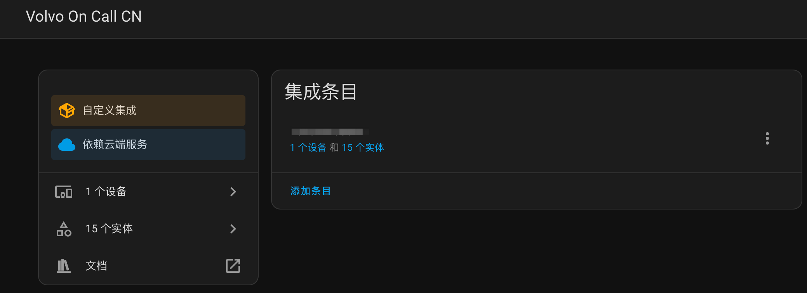
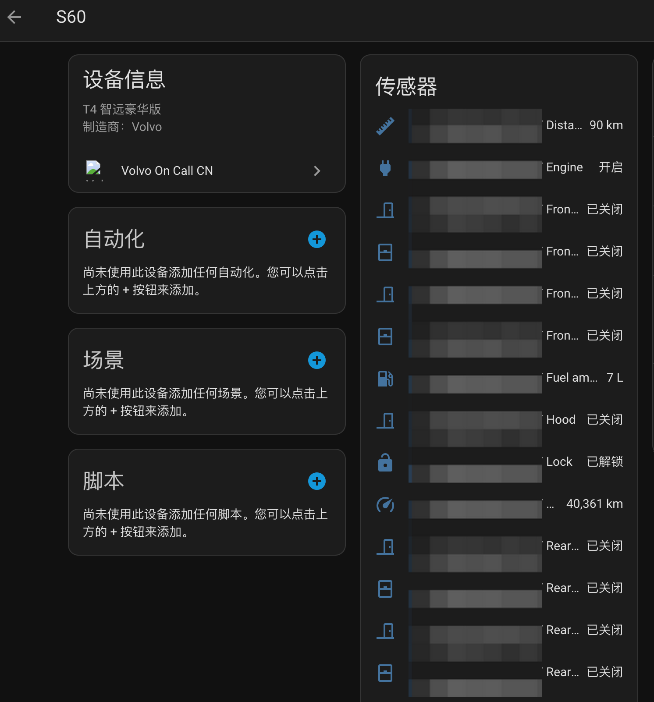

[](https://github.com/idreamshen/hass-volvooncall-cn/releases)
[](https://github.com/hacs/integration)


# Volvo On Call CN

Homeassistant volvooncall 中国区插件，通过中国版沃尔沃API连接车辆并将车辆数据和控制作为Home Assistant实体暴露。

## 功能特点

- 车辆状态监控（锁、引擎、车门、车窗等）
- 远程控制（锁定/解锁、引擎启动/停止、鸣笛、闪灯）
- 燃油和续航信息
- 混动车型支持动力电池电量、纯电续航、充电状态和 TM/TA 行程信息
- 支持按动力类型过滤电类实体
- 车辆位置跟踪
- 车辆警告信息（保养、液位、胎压）
- 支持多车辆
- 使用gRPC高效通信

## 安装要求

- Home Assistant实例
- 沃尔沃在线账户（中国区）
- 具有联网服务的沃尔沃车辆

## HACS 安装集成

HACS -> 集成 -> 右上角三个点 -> 自定义存储库
- 存储库：https://github.com/idreamshen/hass-volvooncall-cn
- 类别：集成

浏览并下载存储库 -> 搜索 Volvo On Call CN 并下载

## 手动安装

1. 从GitHub下载最新版本
2. 将文件解压到Home Assistant的`custom_components`目录
3. 重启Home Assistant

## Homeassistant 添加集成

设置 -> 设备与服务 -> 添加集成 -> 搜索品牌 Volvo On Call CN -> 填入手机号和密码
- 手机号：11 位纯数字
- 密码：即"沃尔沃APP"上的登录密码，需要提前设置好登录密码

提交稍等片刻后，即可看到拥有的车辆设备

动力类型分为“轻混/纯油”和“混动”。已有配置升级后默认保持为“混动”，避免电类实体无提示消失；可在集成“配置”中切换，保存后自动重载。

扫描间隔最小值为 30 秒。集成的定时刷新和实体操作后触发的状态刷新共用同一个协调器节流门，扫描间隔未到时会复用 Home Assistant 中已有的上一份车辆数据，不会额外打完整车辆状态 API 链路。

## T8 满电续航长期统计

混动车型会创建 `sensor.{vin}_full_charge_electric_range`。集成在车辆电量第一次达到 `100%` 时记录当次服务端纯电续航；同一次满电停留期间不会重复采样，电量降到 `100%` 以下后才会等待下一次满电。

该传感器使用距离设备类型和 `measurement` 状态类，可直接进入 Home Assistant Recorder 长期统计。例如：

```yaml
type: statistics-graph
title: T8 满电续航趋势
entities:
  - sensor.testvin0000000001_full_charge_electric_range
days_to_show: 365
period: month
stat_types:
  - mean
```

满电表显续航会受环境温度、空调负载、近期驾驶能耗和车辆估算策略影响，适合观察长期趋势，但不等同于电池管理系统的真实 SOH/可用容量。

## 实体一览

`{vin}` 表示车架号

| ID | 名称 | 备注 |
|-----------------------------------------------|------------------|-----------------------------------------------------------|
| `lock.{vin}_lock` | 车锁 | 远程锁定或解锁车辆 |
| `binary_sensor.{vin}_engine` | 引擎 | |
| `switch.{vin}_engine_remote_control` | 远程启动 | 远程启动 & 空调 |
| `number.{vin}_engine_duration` | 远程启动持续时长 | 单位分钟，默认 5 分钟 |
| `switch.{vin}_climatization` | 温度调节 | 仅开启/关闭驻车空调，不启动车辆，不设置运行时长 |
| `sensor.{vin}_distance_to_empty` | 续航里程 | |
| `binary_sensor.{vin}_front_left_door` | 前左门 | 表示门是否打开 |
| `binary_sensor.{vin}_front_right_door` | 前右门 | |
| `binary_sensor.{vin}_rear_left_door` | 后左门 | |
| `binary_sensor.{vin}_rear_right_door` | 后右门 | |
| `lock.{vin}_window_lock` | 远程窗锁 | 远程开窗或关窗（新款车型支持） |
| `binary_sensor.{vin}_front_left_window_open` | 前左窗 | 表示窗是否打开, 属性`open_status_ajar`表示是否仅打开一条缝 |
| `binary_sensor.{vin}_front_right_window_open` | 前右窗 | |
| `binary_sensor.{vin}_rear_left_window` | 后左窗 | |
| `binary_sensor.{vin}_rear_right_window` | 后右窗 | |
| `sensor.{vin}_fuel_amount` | 油箱剩余油量 | |
| `binary_sensor.{vin}_hood` | 引擎盖 | 表示引擎盖是否打开 |
| `sensor.{vin}_odometer` | 总里程 | |
| `binary_sensor.{vin}_sunroof` | 天窗 | |
| `binary_sensor.{vin}_tail_gate` | 尾门 | |
| `device_tracker.{vin}_position` | 位置 | |
| `device_tracker.{vin}_position_wgs84` | 位置 wgs84 坐标 | 在 ha 默认地图上展示车辆时，请使用此实体 |
| `button.{vin}_flash` | 闪灯 | |
| `button.{vin}_honk_and_flash` | 闪灯鸣笛 | |
| `button.{vin}_honk` | 鸣笛 | |
| `switch.{vin}_sunroof_control` | 远程控制天窗 | 仅在遮阳帘已打开时支持远程打开天窗（新款车型支持） |
| `switch.{vin}_tailgate_control` | 远程控制尾箱 | 打开尾箱会同时解锁车辆,请注意及时锁车（新款车型支持） |
| `sensor.{vin}_fuel_average_consumption_liters_per_100_km` | 百公里油耗 | |
| `sensor.{vin}_tm_distance` | TM 里程 | 手动复位行程，单位 km |
| `sensor.{vin}_tm_fuel_consumption` | TM 平均油耗 | 单位 L/100km |
| `sensor.{vin}_tm_energy_consumption` | TM 平均电耗 | 单位 kWh/100km |
| `sensor.{vin}_tm_average_speed` | TM 平均速度 | 单位 km/h |
| `sensor.{vin}_ta_distance` | TA 里程 | 自动复位行程，单位 km |
| `sensor.{vin}_ta_fuel_consumption` | TA 平均油耗 | 单位 L/100km |
| `sensor.{vin}_ta_average_speed` | TA 平均速度 | 单位 km/h |
| `sensor.{vin}_battery_charge_level` | 动力电池电量 | 单位 % |
| `sensor.{vin}_electric_range` | 纯电续航里程 | 单位 km |
| `sensor.{vin}_full_charge_electric_range` | 最近满电续航 | 100% 电量时每个充电周期采样一次，单位 km，支持长期统计 |
| `sensor.{vin}_charging_status` | 充电状态 | 属性包含数据源和家充桩信息 |
| `sensor.{vin}_charger_connection_status` | 充电枪连接状态 | 属性包含数据源和家充桩信息 |
| `sensor.{vin}_estimated_charging_time` | 预计充满剩余时间 | 单位 min |
| `sensor.{vin}_charging_power` | 充电功率 | 单位 kW |
| `binary_sensor.{vin}_service_warning` | 保养警告 | |
| `sensor.{vin}_service_warning_msg` | 保养警告信息 | 无需保养、未知警告、定期保养即将到期、发动机工作时间即将需要保养、行驶里程即将需要保养、定期保养时间已到、发动机工作时间保养时间已到、行驶里程保养时间已到、定期保养已逾期、发动机工作时间保养已逾期、行驶里程保养已逾期 |
| `binary_sensor.{vin}_brake_fluid_level_warning` | 刹车液警告 | |
| `binary_sensor.{vin}_engine_coolant_level_warning` | 发动机冷却液警告 | |
| `binary_sensor.{vin}_oil_level_warning` | 机油警告 | |
| `binary_sensor.{vin}_washer_fluid_level_warning` | 玻璃水警告 | |
| `binary_sensor.{vin}_front_left_tyre_pressure_warning` | 左前胎压警告 | |
| `binary_sensor.{vin}_front_right_tyre_pressure_warning` | 右前胎压警告 | |
| `binary_sensor.{vin}_rear_left_tyre_pressure_warning` | 左后胎压警告 | |
| `binary_sensor.{vin}_rear_right_tyre_pressure_warning` | 右后胎压警告 | |

动力电池电量、纯电续航和 TM 平均电耗只读取车辆 BatteryService。家充桩接口仅提供充电状态、连接状态、预计时间、功率、名称和地址，不会回填或覆盖车辆电量与纯电续航。

## 测试车型

- 2021 S60
- 2024 XC60

## 故障排查

如果您在使用集成时遇到问题，可以通过在`configuration.yaml`中添加以下内容来启用调试日志：

```yaml
logger:
  default: info
  logs:
    custom_components.volvooncall_cn: debug
```

## 效果预览




## 特别鸣谢

- [@chliny](https://github.com/chliny) 实现了新版车机云端协议对接
